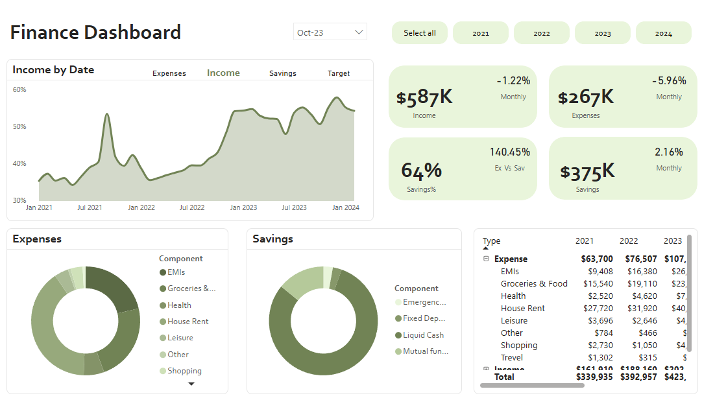

# 💰 Finance Dashboard – Power BI 


## 📌 Project Overview
This is a **Finance Dashboard** I built in **Power BI** as a practice project to improve my data visualization and DAX skills.  
The dataset simulates personal finance data, including **Income**, **Expenses**, **Savings**, and a **Target** benchmark, allowing me to explore advanced Power BI features and design principles.

My main goal was to create a clean, interactive, and insightful dashboard that quickly answers:
- How much do I earn, spend, and save over time?
- How do my savings compare to my target?
- Which expense categories take the biggest share of my budget?
- How are my month-over-month changes trending?

---

## 📊 Key Features
- **Interactive Filters:** Year selector and date slicer for flexible analysis.
- **Dynamic Content:** User-selectable line chart that switches between Income, Expenses, Savings, and Target views
- **Time Intelligence Measures:**
  - Month-over-Month % change 
  - Savings % vs. Target performance tracking
  - Yearly totals by category with growth calculations
- **Visualizations:**
  - **Dynamic Line Chart** with user-controlled measure selection
  - **KPI Cards** for quick financial insights with MoM% changes
  - **Donut Charts** breaking down expenses and savings components
  - **Matrix Table** for year-by-year category comparison
- **Clean & Minimal Design:** Muted green tones for a calm, financial theme

---

## 🛠 Tools & Advanced Skills Used

### **Power BI Desktop**
- Interactive dashboard design and user experience optimization
- Advanced visual formatting and conditional formatting
- Cross-filtering and drill-through functionality

### **Advanced DAX Programming**
- **Dynamic Measure Selection:**
  ```dax
  Line_chart_measures = 
  var selected_val = SELECTEDVALUE(Line_selection_table[No]) 
  RETURN SWITCH(selected_val,1,[Expense%],2,[Income Change MoM%],3,[Savings%],4,[Target])
  ```

- **Virtual Tables & Data Modeling:**
  ```dax
  Line_selection_table = DATATABLE("Type",STRING,"No",INTEGER, 
  { {"Income",1},{"Savings",2},{"Expenses",3},{"Target",4}})
  ```

- **Time Intelligence Functions:**
  - `DATEADD()` for period-over-period comparisons
  - `CALCULATE()` with complex filter contexts
  - `SUMMARIZE()` for creating date hierarchies and groupings

- **Conditional Logic & Error Handling:**
  ```dax
  Expenses_monthly_gr = 
  var val = CALCULATE([Monthly_growth],'Finance Dataset'[Type]="Expense") 
  RETURN if(val=BLANK(),0,val)
  ```

- **Dynamic Titles & Context-Aware Formatting:**
  ```dax
  Dynamic_title = SELECTEDVALUE(Line_selection_table[Type])&" by Date"
  ```

### **Data Modeling Excellence**
- **Star Schema Design:** Fact table with dimension tables for optimal performance
- **Calculated Columns:** Date formatting and hierarchies (`FORMAT()`, `YEAR()`, `MONTH()`)
- **Relationship Management:** One-to-many relationships with proper cardinality
- **Performance Optimization:** Efficient measure design to reduce calculation overhead

### **Data Preparation & Quality**
- **Data Type Handling:** Resolving decimal precision issues during Excel/CSV import
- **Date Intelligence:** Creating custom date hierarchies and period tables
- **Data Validation:** Implementing BLANK() checks and error handling in measures

### **UI/UX Design Principles**
- **Information Hierarchy:** Strategic placement of KPIs and charts
- **Color Psychology:** Green palette for financial trust and growth
- **Responsive Design:** Dashboard works across different screen sizes
- **Accessibility:** Clear labeling and high contrast ratios

---

## 📈 Business Insights Delivered
- **Trend Analysis:** Savings percentage stayed close to target for most months, with occasional spikes indicating successful cost management
- **Budget Allocation:** House Rent (40%+) and Groceries & Food (19%+) consistently represent the largest expense categories
- **Volatility Tracking:** Income shows stable 1-2% monthly fluctuations, while expenses demonstrate higher variability
- **Performance Benchmarking:** Savings vs. Target comparison reveals periods of over/under-performance

---

## 🎯 Technical Challenges Solved
1. **Decimal Precision Issues:** Resolved small decimal values getting rounded to zero by switching from Excel to CSV import format
2. **Dynamic Measure Selection:** Implemented user-controlled chart measures using SWITCH() and SELECTEDVALUE()
3. **Time Intelligence Complexity:** Created robust MoM calculations handling edge cases and blank values
4. **Performance Optimization:** Structured DAX measures for efficient calculation and fast rendering

---

## 🚀 How to Use
1. Download the `.pbix` file from this repository
2. Open it in **Power BI Desktop** (free)
3. Use the year filters and line chart selector to explore different views
4. Hover over charts for detailed tooltips and insights

---

## 💡 Key Learning Outcomes
- **Advanced DAX Patterns:** Mastered complex measure creation with variables, conditional logic, and time intelligence
- **User Experience Design:** Built intuitive interfaces that guide users to insights
- **Data Modeling Best Practices:** Implemented star schema with proper relationships and calculated tables
- **Performance Optimization:** Learned to write efficient DAX that scales with larger datasets
- **Business Intelligence Storytelling:** Created visualizations that answer specific business questions

---

## 📬 Let's Connect
If you have feedback or ideas for improvement, I'd love to hear from you!  
💼 [LinkedIn](https://www.linkedin.com/) 
